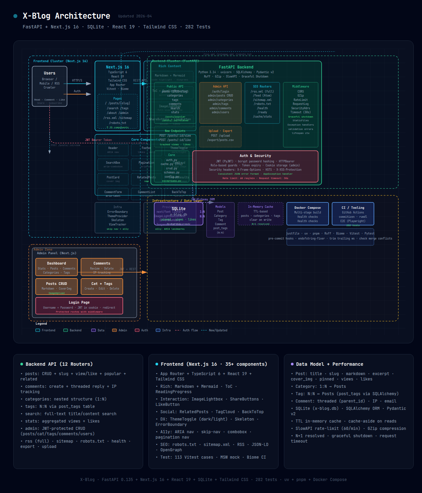

# X-Blog

<div align="center">


A modern full-stack blog application built with FastAPI + Next.js

[English](./README.md) · [中文](./README.zh-CN.md)

</div>

## ✨ Features

- 🚀 **Modern Tech Stack** - Next.js 16, FastAPI, TypeScript 6, Python 3.14
- 📝 **Markdown Support** - Write posts with Mermaid diagrams, KaTeX math, code highlighting
- 🎨 **Beautiful UI** - Clean design with Tailwind CSS v4 + shadcn/ui
- 📱 **Responsive** - Mobile-friendly responsive layout
- 🔒 **Admin Panel** - Built-in admin dashboard for content management
- 🧪 **Well Tested** - 612 tests (346 backend + 266 frontend), 85% backend coverage
- ✅ **Type Safe** - Full TypeScript support + Pydantic validation
- 🔍 **Full-text Search** - Post search functionality
- 🌙 **Dark Mode** - System preference aware dark mode
- 📊 **Reading Analytics** - View counts, like counts, reading progress
- 💬 **Comments** - Nested comment support with replies
- 🏷️ **Tags & Categories** - Organize posts with tags and categories
- 🎯 **SEO Optimized** - Open Graph, JSON-LD structured data
- ⬆️ **Pinned Posts** - Pin important posts to top
- 📤 **Data Export** - Export posts/comments as CSV

## 🚀 Quick Start

### Prerequisites

| Tool    | Version | Install                               |
| ------- | ------- | ------------------------------------- |
| Python  | 3.14+   | [uv](https://github.com/astral-sh/uv) |
| Node.js | 24+     | [Node.js](https://nodejs.org/)        |
| pnpm    | 10+     | `npm install -g pnpm`                 |
| just    | 1.0+    | [just](https://github.com/casey/just) |

```bash
# Install uv (Python package manager)
curl -LsSf https://astral.sh/uv/install.sh | sh
```

### Installation

```bash
# Install all dependencies
just install

# Or manually:
cd backend && uv sync
cd frontend && pnpm install
```

### Development

```bash
# Run both backend and frontend
just dev

# Or run separately:
just backend  # http://localhost:8000
just frontend # http://localhost:3000
```

### 🐳 Docker Deployment

```bash
# Clone and start
git clone https://github.com/pplmx/x-blog.git
cd x-blog

# Configure environment
cp backend/.env.example backend/.env

# Start with Docker Compose
docker-compose up -d

# View logs
docker-compose logs -f
```

See [docs/deployment.md](./docs/deployment.md) for detailed deployment guide.

## 🛠️ Commands

| Command              | Description                                |
| -------------------- | ------------------------------------------ |
| `just install`       | Install all dependencies                   |
| `just dev`           | Run dev servers (backend + frontend)       |
| `just backend`       | Run FastAPI server                         |
| `just frontend`      | Run Next.js dev server                     |
| `just lint`          | Lint code (ruff + biome)                   |
| `just format`        | Format code                                |
| `just test`          | Run all tests (346 backend + 266 frontend) |
| `just test-backend`  | Run backend tests (parallel)               |
| `just test-frontend` | Run frontend tests                         |
| `just fix`           | Auto-fix lint issues                       |
| `just ci`            | Run lint + format + test                   |
| `just clean`         | Clean generated files                      |

## 📡 API Endpoints

### Posts

| Method | Endpoint                  | Description            |
| ------ | ------------------------- | ---------------------- |
| GET    | `/api/posts`              | List posts (paginated) |
| GET    | `/api/posts/{slug}`       | Get post by slug       |
| GET    | `/api/posts/{id}/related` | Get related posts      |
| POST   | `/api/posts`              | Create post            |
| PUT    | `/api/posts/{id}`         | Update post            |
| DELETE | `/api/posts/{id}`         | Delete post            |
| POST   | `/api/posts/{id}/like`    | Like a post            |
| POST   | `/api/posts/{id}/view`    | Increment view count   |

### Comments (Moderated)

| Method | Endpoint                       | Description           |
| ------ | ------------------------------ | --------------------- |
| GET    | `/api/comments/post/{id}`      | Get approved comments |
| POST   | `/api/comments/post/{id}`      | Create comment        |
| DELETE | `/api/comments/{id}`           | Delete comment (admin)|
| PATCH  | `/api/comments/{id}/approve`   | Approve/reject (admin)|

### Admin

| Method | Endpoint                       | Description              |
| ------ | ------------------------------ | ------------------------ |
| POST   | `/api/admin/login`             | Admin login              |
| GET    | `/api/admin/stats`             | Dashboard analytics      |
| GET    | `/api/posts?all=true`          | List all (incl. drafts)  |
| GET    | `/api/comments?approved=false` | List pending comments    |
| PATCH  | `/api/comments/{id}/approve`   | Approve comment          |
| POST   | `/api/upload`                  | Upload image             |
| GET    | `/api/export/posts.csv`        | Export posts             |
| GET    | `/api/export/comments.csv`     | Export comments          |

### Search, SEO & Stats

| Method | Endpoint              | Description                    |
| ------ | --------------------- | ------------------------------ |
| GET    | `/api/search?q=`      | Full-text search               |
| GET    | `/api/stats`          | Blog statistics                |
| GET    | `/rss/feed.xml`       | RSS 2.0 feed                   |
| GET    | `/rss/atom.xml`       | Atom feed                      |
| GET    | `/sitemap.xml`        | XML sitemap                    |
| GET    | `/robots.txt`         | robots.txt                     |
| GET    | `/health`             | Health check                   |

## 🏗️ Architecture



> 📁 [Interactive HTML version](./docs/x-blog-architecture.html) — open locally in browser for zoom/pan. SVG diagram covering: Next.js Frontend, FastAPI Backend, SQLite DB, JWT Auth, Admin Zone, and DevOps tooling.

## 🗂️ Project Structure

```text
x-blog/
├── backend/                 # FastAPI backend
│   ├── app/
│   │   ├── main.py         # Application entry
│   │   ├── config.py       # Configuration
│   │   ├── database.py     # Database setup
│   │   ├── models.py       # SQLAlchemy models
│   │   ├── schemas.py      # Pydantic schemas
│   │   ├── crud.py         # Database operations
│   │   └── routers/        # API routes
│   ├── tests/              # pytest tests (346 tests)
│   └── pyproject.toml      # Python config
│
├── frontend/               # Next.js frontend
│   ├── app/
│   │   ├── page.tsx        # Home page
│   │   ├── admin/          # Admin dashboard
│   │   ├── posts/          # Post pages
│   │   ├── tags/           # Tags page
│   │   └── about/          # About page
│   ├── components/         # React components
│   │   ├── ui/             # shadcn/ui components
│   │   └── *.tsx
│   ├── lib/                # Utilities & API client
│   ├── types/              # TypeScript types
│   └── package.json
│
├── docs/                   # Documentation
├── justfile                # Task runner (recommended)
└── package.json            # Root config (for pnpm workspaces)
```

## 🧰 Tech Stack

### Backend

- **Framework**: [FastAPI](https://fastapi.tiangolo.com/) - Modern Python web framework
- **ORM**: [SQLAlchemy](https://www.sqlalchemy.org/) - Database ORM
- **Database**: SQLite (default), easily switch to PostgreSQL/MySQL
- **Validation**: [Pydantic](https://docs.pydantic.dev/) - Data validation
- **Testing**: [pytest](https://pytest.org/) - Python testing with pytest-xdist for parallel execution
- **Linting**: [ruff](https://docs.astral.sh/ruff/) - Fast Python linter and formatter

### Frontend

- **Framework**: [Next.js 16](https://nextjs.org/) - React framework with App Router
- **UI**: [shadcn/ui](https://ui.shadcn.com/) - UI components
- **Styling**: [Tailwind CSS v4](https://tailwindcss.com/) - CSS framework
- **Forms**: [React Hook Form](https://react-hook-form.com/) - Form handling
- **Testing**: [Vitest](https://vitest.dev/) - Unit testing
- **Linting**: [Biome](https://biomejs.dev/) - Fast JS/TS linter and formatter

### DevOps

- **Package Managers**: [uv](https://github.com/astral-sh/uv) (Python), [pnpm](https://pnpm.io/) (Node.js)
- **Task Runner**: [just](https://github.com/casey/just) - Command runner
- **Linting**: [ruff](https://docs.astral.sh/ruff/) (Python), [Biome](https://biomejs.dev/) (JS/TS)
- **Git Hooks**: [prek](https://github.com/astral-sh/prek) - Git hooks manager

## 🧪 Testing

```bash
# Run all tests
just test

# Run backend tests (parallel)
just test-backend

# Run frontend tests
just test-frontend

# Run tests with coverage
just test-frontend-coverage
```

**Test Statistics:**

- Backend: 346 tests (pytest + pytest-xdist), 85.1% coverage
- Frontend: 266 tests (Vitest), 62.64% coverage
- **Total: 612 tests**

## 🤝 Contributing

1. Fork the repository
2. Create your feature branch (`git checkout -b feature/amazing-feature`)
3. Run tests to ensure everything passes (`just test`)
4. Fix any lint issues (`just fix`)
5. Commit your changes using [Conventional Commits](https://www.conventionalcommits.org/)
6. Push to the branch (`git push origin feature/amazing-feature`)
7. Open a Pull Request

## 📄 License

MIT License - see [LICENSE](LICENSE) for details.

## 🚀 Deployment Guide

See [Deployment Guide](./docs/deployment.md) for detailed instructions on:

- Local development setup
- Docker production deployment
- Separated backend/frontend deployment
- Environment configuration

---

<div align="center">

Built with ❤️ using FastAPI + Next.js

</div>
